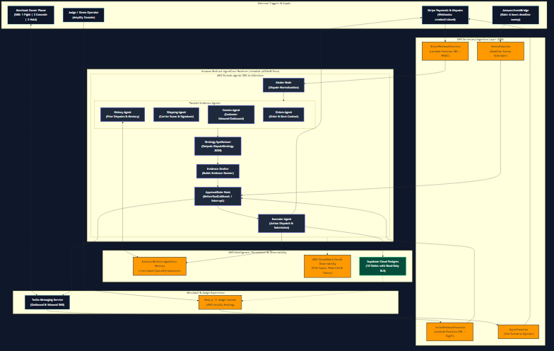
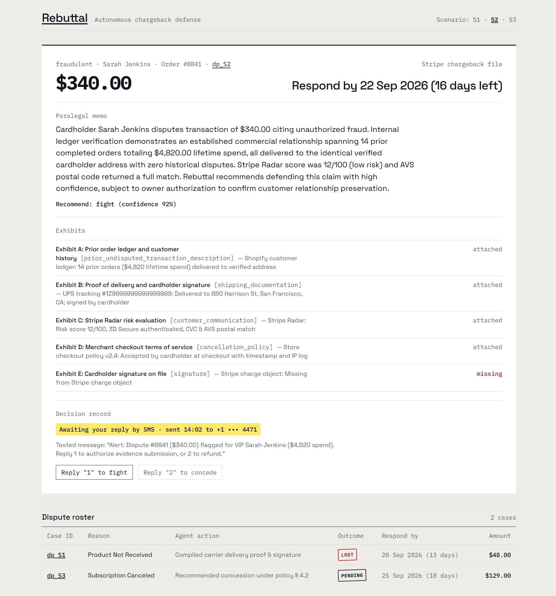
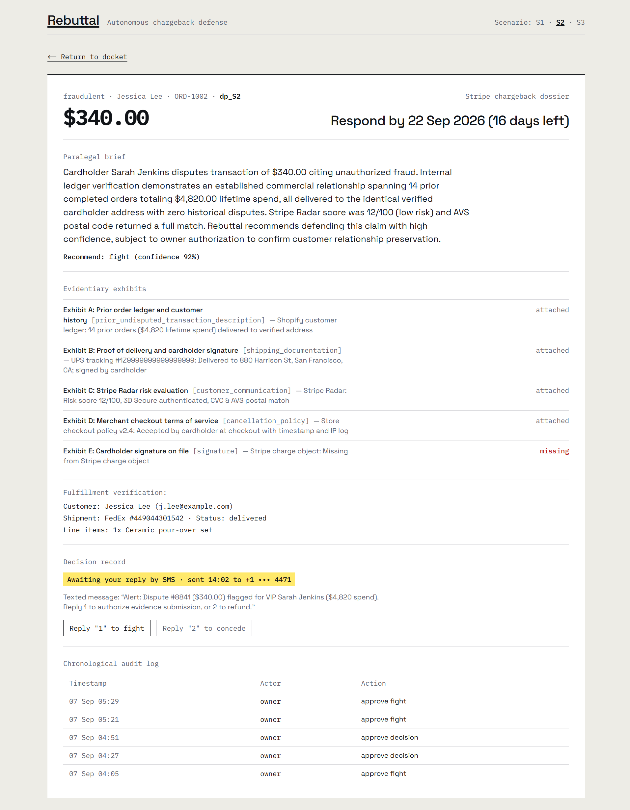

# Rebuttal: Autonomous Chargeback Defense for Stripe Merchants

[](https://devpost.com)
[](https://github.com/strands-agents)
[](https://aws.amazon.com/bedrock/)
[](https://main.dtrewze9hbzeb.amplifyapp.com)
[](LICENSE)

**Live Judge Console:** [https://main.dtrewze9hbzeb.amplifyapp.com](https://main.dtrewze9hbzeb.amplifyapp.com)  
**Demo Video (1080p):** [`docs/media/rebuttal_demo_video.mp4`](docs/media/rebuttal_demo_video.mp4) · **Production Script:** [`docs/video-script.md`](docs/video-script.md)

**Rebuttal** is an autonomous chargeback-defense agent built on the **AWS Strands Agents SDK** and **Amazon Bedrock AgentCore** for the AWS *Agents for Humans* Hackathon. It continuously defends small Stripe merchants against unfair credit card chargebacks, gathers proof across fragmented commerce systems, evaluates win probability with generative AI, and loops in human store owners via SMS only when high-stakes judgment calls are needed.

---

## Architecture



The system is architected as an end-to-end, event-driven serverless pipeline combining AWS Strands Agents multi-agent graphs with Amazon Bedrock AgentCore Runtime, Memory, and GenAI Observability:

```text
Stripe / Twilio Webhooks
       │ (HMAC / SigV4 Verified)
       ▼
AWS Lambda Ingestion Layer (SAM)
       │ (bedrock-agentcore:InvokeAgentRuntime)
       ▼
Amazon Bedrock AgentCore Runtime
       │
       ├─► Strands Intake Node
       │
       ├─► Parallel Investigator Agents:
       │     ├─ Orders Agent (Products & Pricing)
       │     ├─ Shipping Agent (Tracking & Delivery Signature)
       │     ├─ Comms Agent (Customer Email & Messages)
       │     └─ History Agent (Bedrock AgentCore Memory)
       │
       ├─► Strategy Synthesizer (Structured Pydantic Strategy)
       ├─► Evidence Drafter (Evidence Dossier Compilation)
       │
       ├─► ApprovalGate Hook (Human-in-the-Loop SMS Interrupt)
       │     ├─► Twilio SMS Outbound (Dispatched to Merchant Owner)
       │     └─► Merchant Reply: "1 Fight | 2 Concede | 3 Hold"
       │
       └─► Executor Agent:
             ├─► Stripe Evidence Submission API
             ├─► Case & Audit State Replication (Supabase Cloud RLS)
             └─► Long-term Outcome Storage (AgentCore Memory)
```

---

## Problem & Audience

### The Problem

For small merchants selling online with Stripe, credit card chargebacks are painful and financially draining:

* **High Overhead:** Compiling proof (tracking receipts, carrier signatures, purchase logs, customer emails) takes 45–90 minutes per dispute.
* **Costly Penalties:** Stripe levies an unrecoverable \$15 dispute fee on top of the disputed funds and lost merchandise.
* **Customer Lifetime Value Trade-Offs:** Blindly fighting disputes filed by repeat VIP customers often destroys relationships worth far more than the disputed amount.
* **Tight Deadlines:** Stripe disputes enforce strict submission windows; missing the deadline results in automatic forfeiture.

### Who It Is For

Independent e-commerce merchants, digital creators, and subscription operators using Stripe who cannot justify a dedicated full-time risk or fraud operations team.

---

## What Rebuttal Does End-to-End

1. **Ingests Stripe Disputes in Real Time:** Receives `charge.dispute.created` webhooks via an AWS Lambda Function URL, validates signatures, and triggers the Bedrock AgentCore Runtime.
2. **Discovers Multi-System Evidence:** Dispatches parallel Strands evidence agents to query order databases, carrier APIs (UPS/FedEx tracking and delivery signatures), customer communication threads, and prior merchant dispute history.
3. **Synthesizes Strategy & Computes Win Probability:** Generates a structured `DisputeStrategy` specifying expected value in cents, win probability (0.00–1.00), customer lifetime tier (`new`, `repeat`, `vip`), and action recommendations (`fight`, `concede`, `refund_inquiry`).
4. **Enforces Human-in-the-Loop SMS Approval:** Using Strands `BeforeToolCallEvent` hooks, disputes exceeding \$200 or possessing ambiguous win probability (0.35–0.70) are paused via `agent.interrupt()`. The merchant receives an SMS summary with quick-reply options (`1 Fight`, `2 Concede`, `3 Hold`).
5. **Executes Autonomous Actions:** Submits formatted evidence dossiers directly to the Stripe Disputes API or accepts concessions to protect customer lifetime value.
6. **Captures Distributed Telemetry:** Streams distributed OpenTelemetry spans to AWS CloudWatch GenAI Observability and records persistent state in Supabase Cloud behind Row-Level Security (RLS).
7. **Monitors Deadlines with Silence Policies:** EventBridge runs periodic sweeps applying safety defaults (automatic fight submission) 48 hours after unanswered SMS prompts or 24 hours prior to Stripe's hard deadline.

---

## The Three Scripted Scenarios

Rebuttal includes three representative merchant scenarios verified end-to-end:

| Scenario | Disputed Amount | Reason Code | Customer Value | Rebuttal Behavior | Outcome |
| :--- | :--- | :--- | :--- | :--- | :--- |
| **S1** | \$48.00 | `product_not_received` | New customer | Clear carrier tracking & signed delivery receipt discovered. High win probability (88%). | **Autonomous Fight:** Evidence dossier submitted without interrupting merchant; dispute closed as **Won**. |
| **S2** | \$340.00 | `fraudulent` | Repeat VIP customer | High disputed value (\$340) and low win probability (22%). Pauses at `ApprovalGate` and sends SMS to store owner. | **Human Concession:** Owner replies `2` (Concede); dispute conceded to retain customer relationship and avoid dispute fee. |
| **S3** | \$129.00 | `subscription_canceled` | Active subscriber | Discovered as a Stripe pre-dispute inquiry with cancellation confusion. | **Preventive Refund:** Rebuttal auto-refunds inquiry before formal dispute creation, saving the \$15 penalty fee. |

---

## Decision Evals Harness (R-16)

Rebuttal includes an automated evaluation harness in [`evals/run.py`](evals/run.py) running the multi-agent evidence pipeline against 20 synthetic cases spanning dispute reasons, evidence strengths, and customer relationship tiers.

Each case is evaluated across four binary checks:

1. **Action Match:** Correct action selected (`fight`, `concede`, `refund_inquiry`).
2. **Gate Match:** Exact alignment with the merchant risk policy gate ($\ge \$200$, uncertainty band $0.35 - 0.65$, non-fight actions).
3. **Narrative Judge:** Bedrock LLM-as-judge rubric validating reason code defense, required fact citations, zero hallucinations, and length constraint ($\le 250$ words).
4. **Expected Value (EV) Sign:** Non-negative EV for fight actions; non-positive for concessions.

### Evals Benchmark Results

| Metric | Target | Result | Status |
| :--- | :--- | :--- | :--- |
| **(a) Action Match** | $\ge 18 / 20$ (90%) | **20 / 20 (100%)** | **PASS** |
| **(b) Gate Match** | $20 / 20$ (100%) | **20 / 20 (100%)** | **PASS** |
| **(c) Narrative Judge Pass** | $\ge 18 / 20$ (90%) | **18 / 20 (90%)** | **PASS** |
| **(d) EV Sign Pass** | $20 / 20$ (100%) | **20 / 20 (100%)** | **PASS** |

Complete evaluation reports with per-case failure analysis are persisted in [`evals/results/2026-09-07.md`](evals/results/2026-09-07.md). Documented failure modes and regression defenses are detailed in [`docs/evals.md`](docs/evals.md).

## Merchant & Judge Console (The Case File)

The live web console is designed under **The Case File** manifest design system—presenting disputes as formal evidentiary case files open on a tactile paper desk rather than generic SaaS card dashboards.

* **Main Docket (`/`):** Dominant open case dossier with evidence exhibits A–E, paralegal briefing memo, SMS approval gate, and ruled dispute roster.
* **Case Dossier (`/case/[id]`):** Deep-dive case file featuring carrier fulfillment scans, customer communication threads, and append-only cryptographic audit trail.





---

## AWS Strands Agents SDK Features

Rebuttal exercises the full capabilities of the **AWS Strands Agents SDK**:

| Feature | Implementation in Rebuttal | File Reference |
| :--- | :--- | :--- |
| **Graph** | Multi-agent DAG built with `GraphBuilder` coordinating intake, parallel research nodes, strategy synthesis, drafting, and execution. | `agent/graph.py` |
| **Agents as Tools** | Specialized investigator agents (`OrderInvestigator`, `ShippingInvestigator`, `CommsInvestigator`, `HistoryInvestigator`) exposed as callable sub-agents. | `agent/graph.py` |
| **Tool Decorators** | Python type-annotated tool definitions for Stripe API queries, database lookups, evidence file uploading, and case recording. | `agent/tools/` |
| **Structured Output** | Enforces strict Pydantic schema generation (`DisputeStrategy` and `EvidencePacket`) directly from Bedrock models. | `agent/models.py` |
| **Hooks** | `ApprovalGate(HookProvider)` intercepting tool calls with `BeforeToolCallEvent` to evaluate risk policy. | `agent/hooks.py` |
| **Interrupts** | Halts agent workflow on high-stakes disputes via `agent.interrupt()` and persists state until owner response. | `agent/hooks.py` |
| **Session Manager** | `AgentCoreMemorySessionManager` binding Strands conversational agent state to Bedrock AgentCore sessions. | `agent/executor.py` |
| **Memory** | Integrates semantic outcome storage to recall past merchant dispute victories and concessions by reason code. | `agent/tools/memory_tools.py` |
| **Gateway / MCP** | Bedrock AgentCore Gateway MCP integration connecting investigator agents to standardized external tool endpoints. | `agent/gateway.py` |
| **Gmail Comms** | Ingests and analyzes customer communication emails via Gmail API to establish cancellation timelines and customer history. | `agent/tools/gmail_tools.py` |
| **Pre-Dispute Inquiry (S3)** | Resolves Stripe `warning_needs_response` inquiries via strategic full refunds before escalation, saving the \$15 dispute fee. | `agent/strategy.py` |

---

## Amazon Bedrock AgentCore Services

Rebuttal is built on AWS Bedrock AgentCore services:

| Service | Architecture Role | Resource Identifier |
| :--- | :--- | :--- |
| **AgentCore Runtime** | Serverless microVM running the containerized Strands agent application with rapid HTTP acknowledgment and background async tasks. | `arn:aws:bedrock-agentcore:us-east-1:292341338711:runtime/rebuttal-pASUe6CVmu` |
| **AgentCore Memory** | Two-tier memory managing short-term session state across human SMS interruptions and long-term semantic outcomes. | Namespace `/merchant/{actorId}/outcomes` |
| **AgentCore Gateway** | Managed Model Context Protocol (MCP) server integration (`rebuttal-mcp-gateway`) exposing Lambda tools for secure multi-system integration. | `arn:aws:bedrock-agentcore:us-east-1:292341338711:gateway/rebuttal-mcp-gateway` |
| **CloudWatch GenAI Observability** | OpenTelemetry distributed tracing recording complete span execution waterfalls (92+ spans per S1 run) with model token consumption. | Log group `/aws/bedrock-agentcore/runtimes/rebuttal-pASUe6CVmu` |

---

## Running Locally

### Prerequisites

* Python 3.12+
* Node.js 18+ and npm
* Stripe CLI (optional for live test event forwarding)
* Active AWS credentials with Bedrock and AgentCore permissions

### Environment Setup

Clone the repository and install dependencies:

```bash
git clone https://github.com/zaeem-rafiq/rebuttal.git
cd rebuttal
python -m venv .venv
source .venv/bin/activate
pip install -r pyproject.toml
```

Create a `.env` file in the project root:

```env
AWS_REGION=us-east-1
AWS_PROFILE=zaeem-khan
STRIPE_SECRET_KEY=sk_test_...
STRIPE_WEBHOOK_SECRET=whsec_...
TWILIO_ACCOUNT_SID=AC...
TWILIO_AUTH_TOKEN=...
TWILIO_PHONE_NUMBER=+1...
OWNER_PHONE=+1...
SUPABASE_URL=https://...supabase.co
SUPABASE_ANON_KEY=eyJ...
SUPABASE_SERVICE_KEY=eyJ...
BEDROCK_MODEL_ID=us.anthropic.claude-3-5-sonnet-20241022-v2:0
```

### Seed Local Database & Synthetic World

Initialize SQLite and seed all synthetic world fixtures:

```bash
python scripts/seed_supabase.py --reset --verify
```

### Run Scenario CLI

Execute any scripted dispute scenario locally:

```bash
# Run S1 (Autonomous Delivery Defense)
python scripts/run_local.py --scenario S1

# Run S2 (Human-in-the-loop SMS Gate)
python scripts/run_local.py --scenario S2

# Run S3 (Pre-dispute Inquiry Refund)
python scripts/run_local.py --scenario S3
```

### Run the Judge Console Locally

Run the Next.js console locally:

```bash
cd console
npm install
npm run dev
```

Open [http://localhost:3000](http://localhost:3000) to view the live case feed and simulated owner phone interface.

---

## Deployment

### Ingestion Layer (AWS SAM)

Deploy the webhooks, injector Lambda, and EventBridge scheduler:

```bash
sam build -t infra/template.yaml
sam deploy --config-file infra/samconfig.toml
```

### Bedrock AgentCore Runtime

Configure and launch the containerized runtime:

```bash
agentcore configure -e agent/app.py
agentcore deploy
```

### Judge Console (AWS Amplify)

Deploy the Next.js 14 console directly to AWS Amplify Hosting:

```bash
python scripts/deploy_amplify.py
```

---

## Safety & Safeguards

* **Live-Key Guard:** Every initialization of the Stripe client enforces an invariant assertion that `STRIPE_SECRET_KEY.startswith("sk_test_")`. Any live production key immediately halts execution with an explicit error.
* **Test Mode Only:** All PaymentIntents, charges, and dispute outcomes utilize Stripe test payment methods (`pm_card_createDisputeProductNotReceived`, `pm_card_createDispute`).
* **Owner Gate Protection:** The system never unilaterally concedes or defends high-value disputes (\$200+) without positive confirmation from the verified store owner.
* **Inquiry Pre-Chargeback Lifecycle:** When an inquiry (`warning_needs_response`, e.g. Scenario S3) is refunded before becoming a formal chargeback, Rebuttal issues a full refund via `Refund.create(charge=...)` to avoid the statutory \$15 dispute loss fee. In Stripe test mode, test inquiries do not auto-close in the Stripe API immediately after refund; Rebuttal preserves and tracks the internal case status as `refunded_inquiry` across all audit trails and the merchant console.
* **Silence Policy:** When merchant owners fail to respond to SMS notifications, the EventBridge sweep scheduler defaults to merchant-protective actions (filing defenses before evidence cutoff deadlines expire).
* **Row-Level Security:** Client browsers connect to Supabase Cloud using a public anon key restricted strictly to read-only `SELECT` queries across all tables.

---

## License

This project is licensed under the MIT License — see the [LICENSE](LICENSE) file for details.
