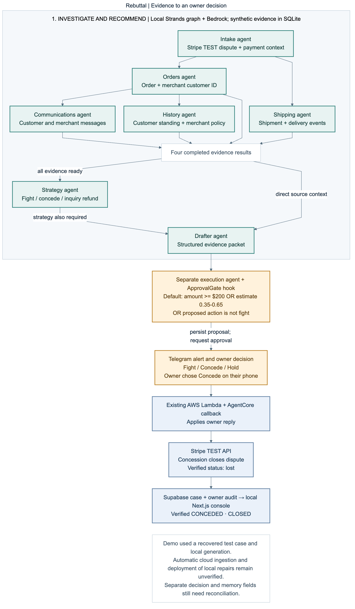

# Rebuttal: chargeback-defense prototype for Stripe merchants

Rebuttal is an AWS Agents for Humans hackathon prototype for small Stripe merchants. A Strands graph gathers evidence, proposes a fight, concession, or inquiry refund, and drafts an evidence packet. An approval hook requests human input for high-value, uncertain, and non-fight actions.

**Watch the product demo:** [Rebuttal on YouTube (2:58)](https://www.youtube.com/watch?v=WRrAUpgRC90)

**Submission:** [project write-up](devpost-submission.md) · [architecture](docs/architecture-submission.md) · [MIT license](LICENSE)

The recording shows the actual console, evidence review, Telegram conversation, and a real owner decision against a Stripe **test-mode** dispute. Merchant evidence is synthetic. The graph and console were run locally; the phone reply reached the cloud callback and closed the test dispute. The hosted console is not the verified judging surface for this release.

## Implemented flow and evidence boundaries

1. Stripe test-mode webhook ingestion is implemented to invoke the AgentCore application. Automatic ingress was not verified in the final recording: the recorded test case required recovery before local graph execution.
2. The Strands graph runs intake, evidence investigation, strategy, and drafting nodes. Order, shipment, and communication evidence comes from seeded records through local SQLite tools or configured Gateway tools. Direct UPS/FedEx and Gmail adapters are not present in this checkout.
3. Model-generated structured outputs contain a proposed action, win-probability estimate, rationale, and evidence narrative. These estimates are not calibrated probabilities of real dispute outcomes.
4. The executor's `ApprovalGate` requests an interrupt when amount is at least $200, probability is in the inclusive 0.35–0.65 band, or the action is not `fight`.
5. Telegram alerts and inline replies were exercised with the owner’s real phone. Selecting **Concede** produced a matching owner audit and a Stripe test dispute status of `lost`; the console displayed **CONCEDED · CLOSED**. This verifies the recorded callback outcome, not native SDK session rehydration. The legacy Twilio path remains and may also send SMS when configured.
6. Execution tools submit evidence, concede, or refund an inquiry using Stripe test keys. A test-mode `won` result does not demonstrate recovery of real merchant funds.
7. Case and audit records support the console. Memory and observability integrations are implemented; configuration and historical proof files are not fresh runtime verification.

Implementation revision `e2c1cd1` adds a shared owner-decision writer for local/cloud records and requires consistent execution audits before attributing closure memory. Missing or conflicting evidence produces an explicit skip while preserving terminal case status. These fixes are tested locally; the [cloud SQL migration](schema/migrations/20260914_owner_decision_sync.sql) is prepared and **not applied**. No new deployment or historical cloud-record repair was performed. See the [verification and remaining limits](docs/proofs/record-consistency-2026-09-14.md).



The [architecture notes](docs/architecture-submission.md) distinguish the recorded path from infrastructure implemented outside that path.

| Responsibility | Source |
|---|---|
| Evidence graph and model prompts | `agent/graph.py` |
| Seeded order, shipment, and communication tools | `agent/tools/evidence_tools.py` |
| Optional Gateway client | `agent/tools/gateway_client.py` |
| Approval policy and Telegram/Twilio alerts | `agent/hooks.py` |
| Executor and session handling | `agent/executor.py`, `agent/app.py` |
| Telegram and legacy SMS ingress | `infra/lambdas/twilio_webhook/app.py` |
| Stripe test-mode actions | `agent/tools/stripe_tools.py` |
| Outcome memory | `agent/tools/memory_tools.py` |

## Scripted scenarios

All three scenarios use synthetic merchant evidence and Stripe test-mode behavior.

| Scenario | Intended demonstration | Boundary |
|---|---|---|
| S1: $48 delivery dispute | Strong evidence leads to a fight without owner interruption | Test-mode outcome; no measured real win rate |
| S2: $340 dispute | Gate requests an owner decision before execution | Real phone Concede and Stripe test closure recorded; automatic ingress and SDK resume remain unverified |
| S3: $129 inquiry | Proposed inquiry refund | Refund is a non-fight action and requires approval; fee savings are not measured |

The deadline sweep contains a silence-policy path. Therefore, this project does not claim that every high-value action always waits indefinitely for positive owner confirmation. See `agent/sweep.py` for that separate behavior.

## Evaluations

[evals/run.py](evals/run.py) evaluates 20 synthetic cases. It checks action agreement, the production hook's interrupt request with external effects mocked, a Bedrock narrative verdict, and EV sign. The gate metric does not exercise SDK suspension, Telegram delivery, session rehydration, or Stripe execution.

The [final grounding acceptance record](docs/proofs/output-grounding/final-acceptance.json) reports **20/20 action, 20/20 gate, 19/20 narrative, and 20/20 EV sign**, with **52/52 evaluator controls**. This reprocessed 20 captured model outputs and obtained new judgments; it was not 20 freshly generated end-to-end executions. Two separate fresh graph cases also passed. One narrative judgment remained a failure, within the predefined threshold. The evaluator is fallible and does not establish zero hallucinations or production dispute success.

Implementation revision `e2c1cd1` passed **256 Python tests** locally with seeded synthetic fixtures and offline provider doubles (September 14, 2026; exit 0). The unchanged console previously passed **12 tests**, TypeScript checking, and a production build; those checks were not rerun for this revision. These checks are separate from the phone/Stripe test-mode observation. Earlier reports, including the September 14 `grounded-v2` 4/20 result, are retained as historical evidence. See [docs/evals.md](docs/evals.md) for the evaluation method and limitations.

## Local setup

Clone the submission branch with Git; evaluation provenance requires its Git metadata. Use Python 3.12+ and the repository's `requirements.txt`. The console has its own npm dependencies.

```bash
git clone --branch codex/record-consistency-20260914 https://github.com/zaeem-rafiq/rebuttal.git
cd rebuttal
python3 -m venv .venv
source .venv/bin/activate
python -m pip install -r requirements.txt
```

Use `.env.example` as the configuration reference and keep local values out of Git. Configured graph runs call Bedrock and can incur usage charges.

### Seed synthetic data locally

```bash
PYTHON_DOTENV_DISABLED=1 AWS_EC2_METADATA_DISABLED=true SUPABASE_URL= SUPABASE_SERVICE_KEY= .venv/bin/python scripts/seed_supabase.py --local-only --verify
```

### Run the evidence graph

```bash
USE_GATEWAY_MCP=false python scripts/run_local.py --scenario S1 --dry-run
```

This runs the evidence graph with Bedrock; it is not an offline acceptance test of the executor or approval delivery.

### Offline checks

Run after the local seed command above.

```bash
PYTHON_DOTENV_DISABLED=1 AWS_EC2_METADATA_DISABLED=true SUPABASE_URL= SUPABASE_SERVICE_KEY= STRIPE_SECRET_KEY=sk_test_mock_for_unit_tests .venv/bin/python -m pytest -q
```

### Console

```bash
cd console
npm ci
npm run dev
```

Open http://localhost:3000. Set the console’s `NEXT_PUBLIC_SUPABASE_URL` and `NEXT_PUBLIC_SUPABASE_ANON_KEY` for your own seeded project. The console can open a specific case at `/case?id=<dispute-id>`. Data availability depends on configuration; a rendered page alone does not prove the agent loop. Run `node --test tests/disputes.test.cjs` from `console/` for the focused record-to-UI checks.

## Deployment and safety

Deployment entry points are `infra/template.yaml`, `agent/app.py`, and `scripts/deploy_amplify.py`. Deployment and webhook setup change external resources and are separate from local checks.

Stripe tools enforce test keys. Synthetic fixtures, model estimates, historical proof notes, live integrations, and actual merchant outcomes must remain labeled separately. This prototype has no demonstrated production win rate or measured merchant time savings.

## License

[MIT](LICENSE)
