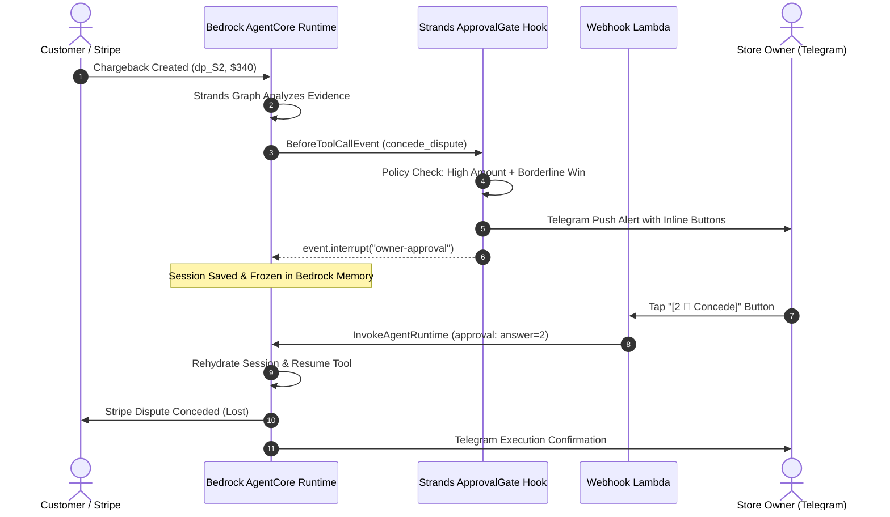

# Human-in-the-Loop over Telegram with AWS Strands Interrupts

*By Zaeem Rafiq · Built for the AWS "Agents for Humans" Hackathon · [GitHub Repository](https://github.com/zaeem-rafiq/rebuttal)*

Autonomous AI agents are incredibly capable at gathering evidence, synthesizing documents, and executing API calls. But in financial and legal domains—like defending credit card chargebacks—giving an LLM unchecked authority to concede hundreds of dollars or trigger irreversible bank submissions is a liability. Merchants demand oversight on edge cases, high-value disputes, or situations where customer lifetime value outweighs a single transaction.

Yet classical human-in-the-loop (HITL) designs suffer from two major flaws:
1. **Thread blocking:** The runtime thread remains locked in memory while waiting for human input, incurring compute costs and risking timeout failures.
2. **Carrier SMS friction:** Out-of-band SMS via standard shortcodes or numbers requires carrier A2P 10DLC campaign registration, which can take weeks to verify and frequently results in carrier delivery rejection (e.g., Twilio Error 30034).

In building **[Rebuttal](https://github.com/zaeem-rafiq/rebuttal)**, an autonomous dispute-defense agent on AWS, we solved both problems by pairing the **AWS Strands Agents SDK's event interrupts** with the **Telegram Bot API** and **Amazon Bedrock AgentCore**.

---

## The Architecture: Non-Blocking Interrupt & Resume

Rather than keeping a serverless function running while waiting for a merchant to respond, the Strands Agents SDK provides an elegant lifecycle event: `BeforeToolCallEvent`. 

When the agent attempts to execute an irreversible tool—such as `concede_dispute` or `submit_evidence`—an `ApprovalGate` hook evaluates the decision against the merchant's risk policy. If the dispute exceeds a dollar threshold ($200), has borderline win probability (35%–65%), or proposes conceding a repeat customer, the hook fires an interrupt:



---

## 1. Catching the Action: The Strands `ApprovalGate` Hook

The Strands hook inspects the proposed tool and merchant state. If approval is needed, it dispatches an interactive push alert and immediately interrupts the agent:

```python
from strands.hooks import HookProvider, BeforeToolCallEvent

class ApprovalGate(HookProvider):
    def register_hooks(self, registry):
        registry.add_callback(BeforeToolCallEvent, self.before_tool_call)

    async def before_tool_call(self, event: BeforeToolCallEvent):
        # Only gate irreversible mutating actions
        if event.tool_name not in {"submit_evidence", "concede_dispute", "refund_inquiry"}:
            return

        strategy = event.agent.state.get("strategy", {})
        amount_cents = strategy.get("amount_cents", 0)
        win_prob = strategy.get("win_probability", 0.5)

        # Evaluate risk policy
        needs_approval = (
            amount_cents >= 20000 or
            (0.35 <= win_prob <= 0.65) or
            strategy.get("action") != "fight"
        )

        if needs_approval and not event.agent.state.get("approval_granted"):
            # Send Telegram Alert with inline buttons
            send_telegram_alert(
                dispute_id=event.agent.state["dispute_id"],
                amount=amount_cents / 100,
                reason=strategy.get("summary")
            )
            
            # Freeze execution; record interrupt reason
            event.interrupt(
                name="owner-approval",
                reason={
                    "dispute_id": event.agent.state["dispute_id"],
                    "action": event.tool_name,
                }
            )
```

---

## 2. Zero-Friction Mobile Alert: Telegram Bot API

Instead of asking the merchant to open a dashboard and log in, the alert lands as a Telegram push notification on their phone with an inline keyboard:

```python
import os, json, urllib.request

def send_telegram_alert(dispute_id: str, amount: float, reason: str):
    bot_token = os.environ["TELEGRAM_BOT_TOKEN"]
    chat_id = os.environ["TELEGRAM_CHAT_ID"]
    
    keyboard = {
        "inline_keyboard": [[
            {"text": "1 ⚔️ Fight", "callback_data": f"ans:1:{dispute_id}"},
            {"text": "2 🤝 Concede", "callback_data": f"ans:2:{dispute_id}"},
            {"text": "3 ⏸️ Hold", "callback_data": f"ans:3:{dispute_id}"}
        ]]
    }
    
    payload = {
        "chat_id": chat_id,
        "text": f"⚠️ *Action Required: ${amount:.2f} Dispute*\n\n{reason}",
        "parse_mode": "Markdown",
        "reply_markup": keyboard
    }
    
    req = urllib.request.Request(
        f"https://api.telegram.org/bot{bot_token}/sendMessage",
        data=json.dumps(payload).encode("utf-8"),
        headers={"Content-Type": "application/json"}
    )
    urllib.request.urlopen(req, timeout=10)
```

By using Telegram's Bot API, messages deliver in under 500ms with zero carrier compliance hurdles, full end-to-end encryption, and interactive button callbacks.

---

## 3. The Callback: Resuming Bedrock AgentCore Runtime

When the store owner taps **[2 🤝 Concede]**, Telegram sends a webhook payload to our AWS Lambda function URL. The Lambda parses the callback query, sends a visual toast confirmation to the user, and resumes the Bedrock AgentCore runtime:

```python
def lambda_handler(event, context):
    body = json.loads(event["body"])
    
    if "callback_query" in body:
        query = body["callback_query"]
        action_code, dispute_id = query["data"].split(":")[1:]
        
        # Acknowledge the button tap in Telegram UI
        answer_telegram_callback(query["id"], "Decision recorded. Resuming agent...")
        
        # Resume Bedrock AgentCore Runtime Session
        client = boto3.client("bedrock-agentcore")
        client.invoke_agent_runtime(
            agentRuntimeId=os.environ["AGENT_RUNTIME_ID"],
            runtimeSessionId=f"rebuttal-{dispute_id}",
            payload=json.dumps({
                "type": "approval",
                "dispute_id": dispute_id,
                "answer": action_code  # "1", "2", or "3"
            })
        )
        return {"statusCode": 200, "body": "OK"}
```

The runtime unpauses with the merchant's choice cached in memory. If the owner confirmed the agent's recommendation, the tool executes immediately; if they overrode it (e.g., opting to concede a VIP customer), the agent cancels the original call and executes the owner's choice instead.

---

## Conclusion

Human-in-the-loop should never mean blocking compute threads or clunky login portals. Combining the AWS Strands Agents SDK's event interrupts with serverless webhooks and mobile messaging channels creates an agent architecture that is cost-efficient, resilient, and human-friendly.

*Explore the complete source code, deployment templates, and evals on GitHub: **[https://github.com/zaeem-rafiq/rebuttal](https://github.com/zaeem-rafiq/rebuttal)***
