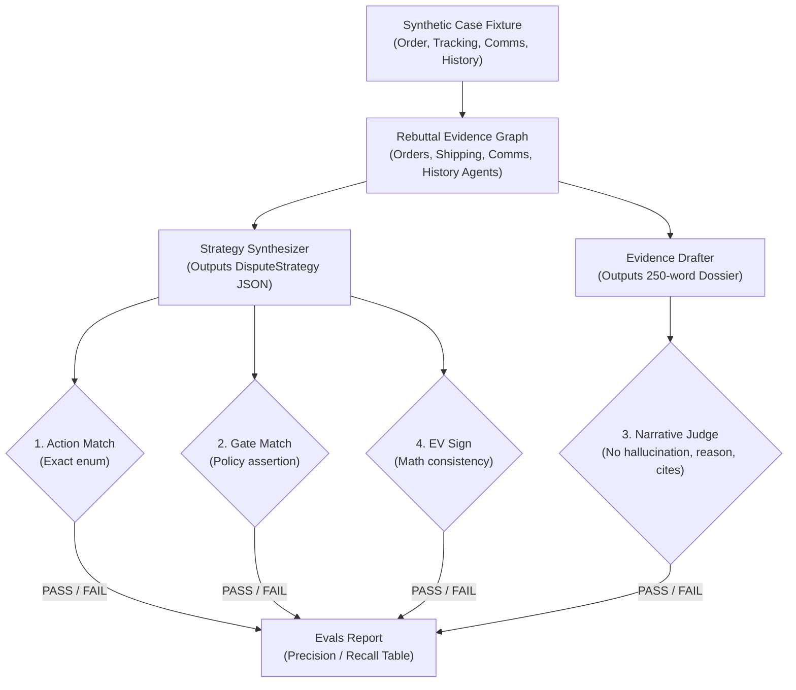

# Evals for an Agent That Decides: Binary Checks for Fight, Concede, or Refund

*By Zaeem Rafiq · Built for the AWS "Agents for Humans" Hackathon · [GitHub Repository](https://github.com/zaeem-rafiq/rebuttal)*

Most LLM evaluation frameworks rely on subjective 1-to-5 scoring scales—"Rate this tone from 1 to 5" or "Assess how helpful this explanation was." While acceptable for conversational chatbots, qualitative grading fails completely for autonomous agents making legal and financial decisions.

When defending credit card chargebacks on Stripe, an agent doesn't need to be "creative." It needs to make the mathematically and procedurally correct decision: **Fight**, **Concede**, or **Refund**. If an agent hallucinates a delivery signature, argues shipping tracking on a subscription-cancellation dispute, or forfeits a winnable $500 dispute for a one-time buyer, it directly costs the merchant real money.

In **[Rebuttal](https://github.com/zaeem-rafiq/rebuttal)**, we rejected subjective Likert scores in favor of a strict, deterministic evaluation harness built on four binary pass/fail checks.

---

## The 20-Dispute Golden Set

To evaluate our multi-agent evidence pipeline (powered by the AWS Strands Agents SDK and Amazon Bedrock AgentCore), we created a synthetic golden dataset of 20 disputes (`evals/cases/case_01.json` through `case_20.json`).

The dataset spans all major credit card network reason codes across three distinct dimensions:
* **Reason Code:** `product_not_received`, `fraudulent`, `subscription_canceled`, `duplicate`, `product_unacceptable`, `credit_not_processed`, and `inquiry`.
* **Evidence Strength:** Strong (signed carrier delivery), Mixed (delivered without signature, conflicting comms), or Weak (no tracking, customer requested cancellation prior to shipment).
* **Customer Value:** New one-off buyer, Repeat customer, or High-LTV VIP.



---

## The Four Binary Checks

Every case evaluation is executed without mutating Stripe state, evaluating four uncompromising checks:

### 1. Action Match (`action_match: bool`)
The agent's synthesized strategy action must match the expected optimal action (`fight`, `concede`, or `refund_inquiry`). An agent that concedes when winning evidence is in hand fails immediately.

### 2. Gate Match (`gate_match: bool`)
Our human-in-the-loop policy dictates that any dispute $\ge \$200$, any case with uncertain win probability ($0.35 \le p \le 0.65$), or any proposed concession must halt for merchant authorization. This assertion checks whether the agent's gate state matches ground truth:
```python
expected_gate = (
    case["amount_cents"] >= 20000 or
    0.35 <= case["win_prob"] <= 0.65 or
    case["action"] != "fight"
)
assert agent_gate_triggered == expected_gate
```

### 3. Narrative Judge (`judge_pass: bool`)
When fighting, the Evidence Drafter compiles a concise legal submission. A secondary Bedrock judge model evaluates the text under strict boolean rubrics:
* **Reason code alignment:** Does the narrative specifically address the disputed chargeback reason? (Argues AVS/CVV matching for fraud; argues carrier delivery for merchandise).
* **Mandatory citations:** Does it cite the exact carrier tracking number, delivery date, and signature from the fixture?
* **Zero hallucinations:** Does it claim any fact not present in the record? (e.g., claiming a signature when only a porch drop photo exists).
* **Brevity constraint:** Is the narrative $\le 250$ words? (Arbitrators discard verbose essays).

### 4. Expected Value Sign (`ev_sign: bool`)
Mathematical sanity check:
$$\text{Expected Value} = (\text{Win Probability} \times \text{Dispute Amount}) - \text{Dispute Fee}$$
The EV must be strictly positive ($\ge 0$) to justify fighting, or negative ($\le 0$) when conceding or refunding.

---

## The 5 Fatal Failure Modes Caught

By running `uv run python evals/run.py` in CI, we systematically eliminated five subtle failure modes that plague LLMs in autonomous finance:

| Failure Mode | How It Manifests | Catching Check |
| :--- | :--- | :--- |
| **Evidence Hallucination** | Drafter invents recipient signatures or tracking IDs to bolster weak cases | `judge_pass` (no hallucination) |
| **Wrong Reason Narrative** | Cites delivery scans for a subscription cancellation dispute | `judge_pass` (reason alignment) |
| **Gate Bypass** | High-dollar charge ($340) auto-concedes without merchant review | `gate_match` |
| **Over-Conceding** | Concedes a winnable dispute for a first-time buyer with delivery proof | `action_match` |
| **Under-Fighting** | Drops win probability to 0.40 despite full GPS and signature delivery | `action_match` + EV check |

---

## Why Binary Evals Matter for Autonomous Agents

When software takes autonomous actions on real accounts, continuous scores (e.g., "78% alignment") are useless because you cannot place an automated deployment gate on subjective percentages. 

Binary evals turn fuzzy LLM reasoning into standard software unit tests. Either the agent respects the merchant's policy, cites verified facts, and chooses the right strategy, or the build fails.

*View the complete golden set and run the evals locally: **[https://github.com/zaeem-rafiq/rebuttal](https://github.com/zaeem-rafiq/rebuttal)***
