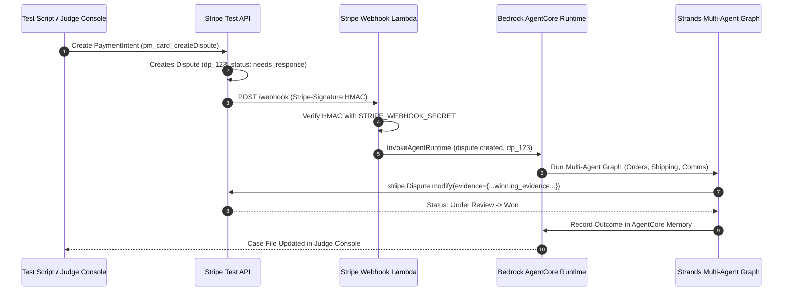

# Simulating Stripe Disputes End-to-End for Autonomous Agent Demos

*By Zaeem Rafiq · Built for the AWS "Agents for Humans" Hackathon · [GitHub Repository](https://github.com/zaeem-rafiq/rebuttal)*

Building an AI agent that monitors financial webhooks and drafts legal evidence is an exciting technical challenge. But demonstrating that it works in the real world presents a massive operational roadblock: **credit card disputes take 60 to 120 days to settle**.

Worse, you cannot test on live Stripe accounts without incurring non-refundable network dispute fees ($15 per occurrence) and risking merchant account termination for artificial disputes. On the other hand, merely mocking API responses in a unit test proves nothing to a hackathon judge or merchant owner—it fails to validate live webhook delivery, cryptographic signature verification, serverless payload buffering, or asynchronous runtime execution.

In developing **[Rebuttal](https://github.com/zaeem-rafiq/rebuttal)**, we established a take-ready end-to-end simulation environment that triggers, investigates, and resolves real Stripe disputes in under **60 seconds**, using Stripe's native test-mode simulation tokens.

---

## The Secret: Stripe's Specialized Dispute Test Tokens

Stripe's test environment provides specialized `PaymentMethod` tokens that trigger immediate dispute lifecycle events when a charge is confirmed:

1. **Immediate Chargeback (`pm_card_createDispute`):**
   When used to create a `PaymentIntent`, Stripe generates a standard charge and immediately opens a `charge.dispute.created` event with status `needs_response`.
2. **Pre-Dispute Inquiry (`pm_card_createDisputeInquiry`):**
   Generates an inquiry with status `warning_needs_response`. This mimics an issuing bank asking for clarification before a dispute is officially registered—giving an agent the window to issue a full refund and avoid the $15 dispute fee.
3. **Forcing Outcomes (`winning_evidence`):**
   When submitting evidence via `stripe.Dispute.modify(dispute_id, evidence={...})`, including the magic string `winning_evidence` anywhere in the narrative instructs Stripe's test simulator to rule the dispute `status: won` upon submission.

---

## The End-to-End Architecture

Instead of mocking Stripe in memory, our test scenario injector creates real test charges directly against the Stripe API. The entire cloud loop operates live:



---

## 1. Injecting Deterministic Test Disputes

We encapsulated our test scenarios into a deterministic CLI injector (`scripts/simulate_dispute.py`):

```python
import stripe, os

stripe.api_key = os.environ["STRIPE_SECRET_KEY"]

def inject_scenario_s1():
    """Scenario 1: $180 Merchandise Dispute with rock-solid delivery proof."""
    # 1. Create a customer
    customer = stripe.Customer.create(
        name="Alex Mercer",
        email="alex.mercer@example.com"
    )
    
    # 2. Create and confirm PaymentIntent using the dispute simulation token
    intent = stripe.PaymentIntent.create(
        amount=18000,
        currency="usd",
        customer=customer.id,
        payment_method="pm_card_createDispute",
        confirm=True,
        automatic_payment_methods={"enabled": True, "allow_redirects": "never"},
        metadata={"order_id": "ORD-1001", "scenario": "S1"}
    )
    
    # Stripe immediately attaches a dispute to the charge
    charge = stripe.Charge.retrieve(intent.latest_charge)
    print(f"Created live test dispute: {charge.dispute}")
    return charge.dispute
```

---

## 2. Verifying Signatures at the Serverless Edge

To ensure production security, our AWS SAM template provisions `rebuttal-stripe-webhook` on a dedicated Lambda Function URL. The handler verifies the cryptographic signature before dispatching to the agent runtime:

```python
import json, stripe, os, boto3

def lambda_handler(event, context):
    payload = event.get("body", "")
    sig_header = event["headers"].get("stripe-signature", "")
    secret = os.environ["STRIPE_WEBHOOK_SECRET"]

    try:
        stripe_event = stripe.Webhook.construct_event(payload, sig_header, secret)
    except Exception as e:
        return {"statusCode": 400, "body": f"Signature verification failed: {e}"}

    event_type = stripe_event["type"]
    if event_type == "charge.dispute.created":
        dispute = stripe_event["data"]["object"]
        
        # Invoke Amazon Bedrock AgentCore Runtime
        client = boto3.client("bedrock-agentcore")
        client.invoke_agent_runtime(
            agentRuntimeId=os.environ["AGENT_RUNTIME_ID"],
            runtimeSessionId=f"rebuttal-{dispute['id']}",
            payload=json.dumps({
                "type": "dispute.created",
                "dispute_id": dispute["id"],
                "amount": dispute["amount"]
            })
        )
        return {"statusCode": 200, "body": "Dispute queued"}
```

---

## 3. The 60-Second Demo Reset

To guarantee clean, repeatable live demonstrations for judges without residual state, we built `scripts/reset_demo.py`. With one command, it:
1. Archives previous dispute records to local JSON.
2. Reseeds the PostgreSQL database with pristine order, shipment, and customer history.
3. Health-checks all Lambda Function URLs, Bedrock AgentCore Runtime, and live webhooks.
4. Leaves the system in an immediate "Take-Ready" state.

---

## Conclusion

Testing and demonstrating autonomous agent software requires the same architectural rigor as building it. By combining Stripe's specialized dispute tokens with AWS Lambda Function URLs and Bedrock AgentCore, you can validate asynchronous, event-driven agent pipelines against live network webhooks in seconds rather than months.

*Explore our dispute simulator, SAM deployment templates, and Next.js console: **[https://github.com/zaeem-rafiq/rebuttal](https://github.com/zaeem-rafiq/rebuttal)***
